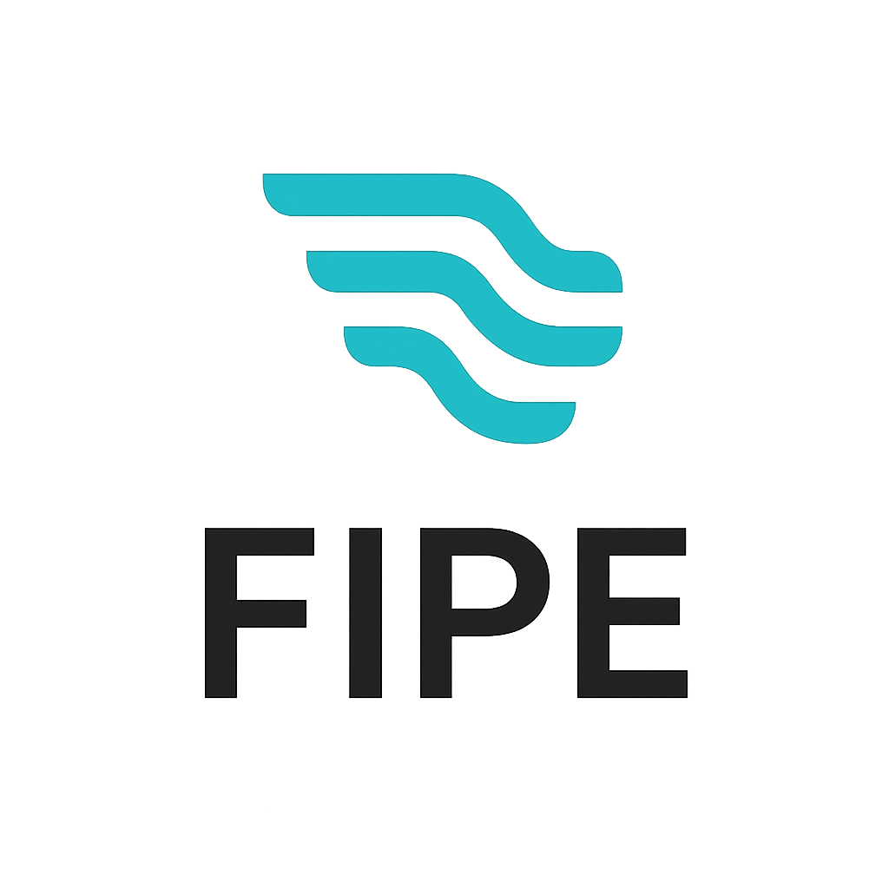

Fipe is a lightweight Kotlin Multiplatform library for building asynchronous and composable data pipelines using Kotlin `Flow`.  
It enables you to chain together small, focused processing steps—such as mapping, buffering, and parallel transformation—to build complex, efficient data flows.

## Features

- **Composable Pipelines**: Chain multiple transformation steps (`then`) to process streams of data.
- **Flexible Steps**: Includes mapping, buffering, and parallel ordered processing out-of-the-box.
- **Kotlin Multiplatform**: Runs on JVM, Android, and iOS via Kotlin Multiplatform.
- **Coroutine & Flow-based**: Naturally asynchronous and non-blocking.

## Quick Example

```kotlin
import fipe.step.MapStep
import fipe.step.BufferedMapStep
import fipe.step.ParallelOrderedStep
import fipe.fipe
import kotlinx.coroutines.flow.flowOf
import kotlinx.coroutines.runBlocking

fun main() = runBlocking {
    val pipeline = fipe<Int>()
        .then(MapStep { it * 2 })
        .then(BufferedMapStep(capacity = 10) { it + 1 })
        .then(ParallelOrderedStep { listOf(it, it + 1) })

    val input = flowOf(1, 2, 3, 4, 5)
    val result = pipeline.toFlow(input).toList()

    // result: [[3, 4], [5, 6], [7, 8], [9, 10], [11, 12]]
    println(result)
}
```

A pipeline is constructed by chaining steps using .then(...).
Each step can transform, buffer, or parallelize elements as the flow moves through.

## License

This project is licensed under the Apache License 2.0.